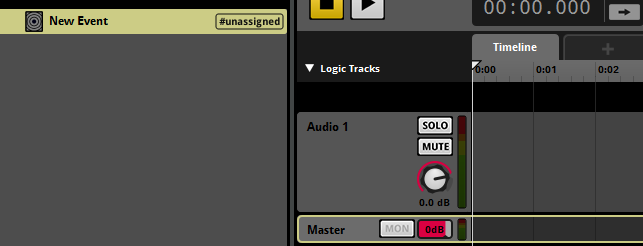

### FMOD Plugin Guide 
 

#### HyperealVR FMOD Audio Spatializer Plugin Guide
1.  To install and enable the plugin in FMOD Studio, please copy/extract HyprealAudioFMODPlugin.dll to _FMODStudioDir_\plugins.  Please make sure that you've installed Hypereal runtime.

2.  In FMOD Studio, create a new event.
    

3.  Select the Master Track.
    

4.  Delete the 3D Panner.
    

5.  Add the Hypereal Audio Plugin for FMOD.
    