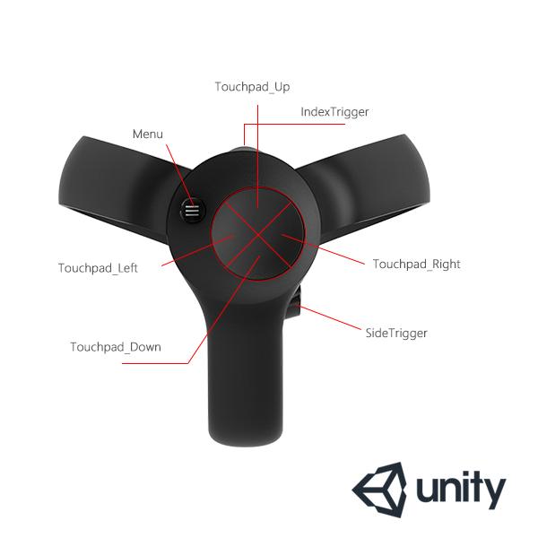

### Key Mapping
 

Here inllustrates the values we use in SDK and pluins mapping to a real model. Note: The Home button with Hypereal logo on the right has no event because it is not for developing.

**Note:** The Home button(on the right touch with Hypereal logo) is not for developers so that there isn't any event for it.

#### PC SDK

#### Unreal

If you want to get more details between unreal key and SDK value, please read "Unreal Plugin User Guide" --> "Button Mapping".

#### Unity

For Unity, we distinguish left and right controller with L/R labels, you can check the demo for more details.