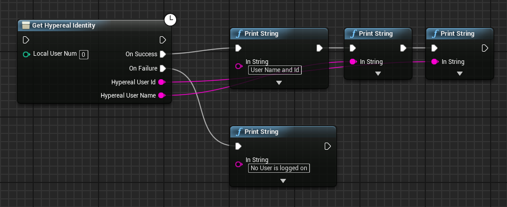

### Identity 
 

After the user launch application , you may need to get the user info and verify the user is authorized. Some Blueprints are available.

1) Get Hypereal Identity
 
Through this blueprint , you can get the current logged in Hypereal user. If Hypereal service is not installed or no user is logged in, it will execute the flow of On Failure.
Example:

2) Verify User Authorization
 
Through this blueprint , you can verify the current user is authorized to run the application. You should always do this step when you submit your applications to the Hypereal Store.
Example:

