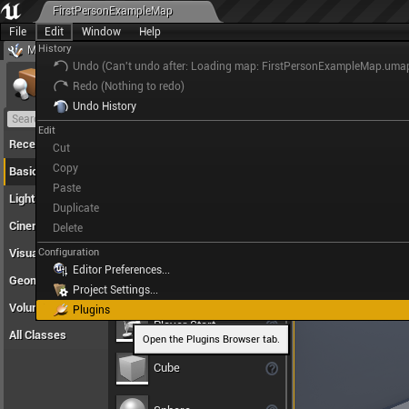

### Check Hypereal VR Plugin
 

1. If the installation is successful, the HyperealVR plugin should be enabled by default. If not, you can open the Edit tab from the Main Toolbar of UE and then select the Plugins menu

2. Find the Virtual Reality section, enable the HyperealVR plugin , click the Restart Now button

If using engine installed by Epic Luancher, then it would be in "Virtual Reality" of "Installed" tab.

3. Launch the level using the VR Preview mode

