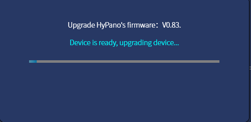

### Firmware Upgrade

- If new firmware is available, a red dot will show on the Hypereal monitor.

- Open Devices Page of HyperealVR and choose a *Updates on available* device. Click *Firmware Upgrade* button.

- Click the *Firmware update* button and a confirm dialog will pop up.

- Click *Update* button to update firmware.

- Once update is done, a confirm dialog will pop up. Click *Confirm* button to finish the whole process.

